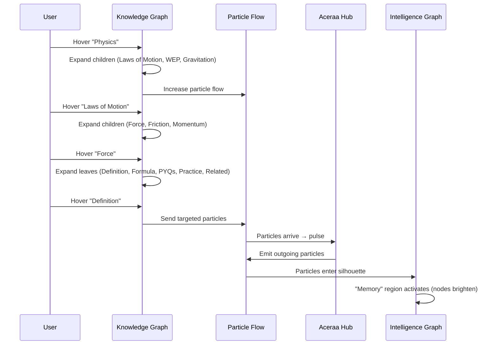

# Aceraa Interactive Hero Section — Implementation Plan

Build a production-grade interactive hero that visually communicates:  
**Knowledge → Aceraa → Student Intelligence**

## User Review Required

> [!IMPORTANT]
> **Brand Name**: The navbar uses "Aceraa" but the logo image reads "Accerra". The reference image shows "ACERAA". I will use **"ACERAA"** as the display wordmark in the hero center hub, matching the reference design. Please confirm.

> [!IMPORTANT]
> **Existing Hero Replacement**: This will completely replace the current [Hero.jsx](file:///c:/Users/samxp/accerra-app/components/sections/Hero.jsx). The existing hero (logo + tagline + prompt box) will be removed. All other sections (StatsReveal, Problem, BentoFeatures, etc.) remain untouched.

> [!WARNING]
> **Tailwind v4**: The project uses Tailwind CSS v4 (`@tailwindcss/postcss` v4 + `tailwindcss` v4). I'll use `@import "tailwindcss"` syntax and `@theme inline` for custom tokens, which are already in [globals.css](file:///c:/Users/samxp/accerra-app/app/globals.css).

## Open Questions

1. **Logo**: Should I recreate the triangular "A" logo from the reference image as SVG, or use the existing `aceraa-logo.jpeg`? I plan to **create a custom SVG** of the geometric "A" to enable pulse/glow animations.
2. **Bottom Features Strip**: The reference image shows 4 feature cards at the bottom (Personalized Learning, Connected Knowledge, AI-Powered Understanding, Continuous Growth). Should I include these as part of the hero, or are they separate?
3. **Hover Hint**: The reference shows a "Hover over any topic" tooltip at bottom-left. I'll include this as a subtle onboarding hint that fades after first interaction.

---

## Component Architecture

```mermaid
graph TD
    A["HeroSection"] --> B["KnowledgeGraph"]
    A --> C["ParticleFlow"]
    A --> D["AceraaHub"]
    A --> E["IntelligenceGraph"]
    A --> F["HeroBackground"]
    A --> G["FeatureStrip"]
    
    B --> B1["SubjectNode"]
    B --> B2["TopicNode"]
    B --> B3["ConceptNode"]
    B --> B4["LeafNode"]
    B --> B5["TreeConnector"]
    
    C --> C1["SVG Path Definitions"]
    C --> C2["Particle Emitter"]
    
    D --> D1["Logo SVG"]
    D --> D2["Pulse Ring"]
    D --> D3["Processing Status"]
    
    E --> E1["Silhouette SVG"]
    E --> E2["Neural Nodes"]
    E --> E3["Neural Connections"]
    E --> E4["Region Labels"]
    E --> E5["Activation Wave"]
    
    F --> F1["Noise Texture"]
    F --> F2["Faint Grid"]
    F --> F3["Ambient Particles"]
```



### File Structure

```
components/
  hero/
    HeroSection.tsx          — Root orchestrator, layout, scroll parallax
    KnowledgeGraph.tsx       — Left panel: interactive knowledge tree
    ParticleFlow.tsx         — SVG particle system between panels  
    AceraaHub.tsx            — Center: logo + wordmark + pulse effects
    IntelligenceGraph.tsx    — Right panel: silhouette + neural network
    HeroBackground.tsx       — Background layers (noise, grid, ambient)
    FeatureStrip.tsx         — Bottom feature cards
    hooks/
      useParticleSystem.ts   — Particle animation loop (requestAnimationFrame)
      useNeuralNetwork.ts    — Neural node generation & animation
      useScrollParallax.ts   — Scroll-based parallax offsets
    types.ts                 — Shared TypeScript interfaces
    constants.ts             — Knowledge hierarchy data, node positions
```

---

## State Model

```typescript
// types.ts
interface HeroState {
  // Knowledge Graph
  expandedSubject: string | null;     // "Physics" | "Mathematics" | "Chemistry" | null
  expandedTopic: string | null;       // "Laws of Motion" | null
  expandedConcept: string | null;     // "Force" | null
  hoveredLeaf: string | null;         // "Definition" | "Formula" | "PYQs" | "Practice" | "Related Concepts" | null
  
  // Particle Flow
  activeFlowTarget: IntelligenceRegion | null;
  particleIntensity: number;          // 0-1, increases on hover
  
  // Intelligence Graph
  activeRegion: IntelligenceRegion | null;
  
  // Scroll
  scrollY: number;
}

type IntelligenceRegion = 
  | "memory"           // activated by "Definition" hover
  | "understanding"    // activated by general subject hover
  | "reasoning"        // activated by "Formula" hover
  | "problemSolving"   // activated by "PYQs" hover
  | "connections";     // activated by "Related Concepts" hover

// Interaction mapping
const LEAF_TO_REGION: Record<string, IntelligenceRegion> = {
  "Definition": "memory",
  "Formula": "reasoning",
  "PYQs": "problemSolving",
  "Practice": "understanding",
  "Related Concepts": "connections",
};
```

State is managed via `useState` in `HeroSection.tsx` and passed down as props. No context needed — the tree is shallow (max 2 levels deep).

---

## Knowledge Hierarchy Data

```typescript
// constants.ts
const KNOWLEDGE_TREE = {
  Physics: {
    icon: "atom",
    children: {
      "Laws of Motion": {
        children: {
          Force: {
            children: ["Definition", "Formula", "PYQs", "Practice", "Related Concepts"]
          },
          Friction: { children: [] },
          Momentum: { children: [] }
        }
      },
      "Work Energy Power": { children: {} },
      "Gravitation": { children: {} }
    }
  },
  Mathematics: {
    icon: "sigma",
    children: { /* collapsed by default */ }
  },
  Chemistry: {
    icon: "flask",
    children: { /* collapsed by default */ }
  }
};
```

---

## SVG Structure

### 1. Knowledge Graph (Left)

- Each node is a `<g>` containing a `<circle>` + `<text>`
- Tree connections are `<line>` or `<path>` elements with animated `stroke-dashoffset`
- On hover expand: children fade in with `opacity: 0→1` and `transform: translateX(-10→0)`
- Node dots: 4px circles, white fill at varying opacities
- Subject icons: minimal SVG icons (atom, sigma, flask) — hand-drawn, ~16x16

### 2. Particle Flow (Center)

- SVG overlay spanning the full hero width
- **Paths**: 3-5 cubic bezier `<path>` elements from knowledge graph edge → Aceraa hub
- **Particles**: `<circle r="1.5">` elements animated along paths using `getPointAtLength()`
- Each path has 8-12 particles at staggered positions
- Particle pool: ~40-50 total particles (lightweight)
- Animation: `requestAnimationFrame` loop, position updated via path length offset
- On hover: particle speed increases, count doubles, glow intensifies

### 3. Aceraa Hub (Center)

- Custom SVG geometric "A" logo (~80x80)
- Concentric rings: 2-3 `<circle>` elements with animated `opacity` and `scale`
- Pulse: triggered when particles reach the center, uses CSS `@keyframes`
- Glow: `<radialGradient>` with `filter: blur()` — very subtle, white at 5-10% opacity
- Wordmark: "ACERAA" in tracked uppercase below logo
- Tagline: "Building the Intelligence Layer for Every Student" in muted white

### 4. Human Intelligence Graph (Right)

- **Silhouette**: Custom SVG path — upper torso (head, neck, shoulders), gender-neutral, minimalist white outline (`stroke-width: 1`, `fill: none`)
- **Neural Nodes**: 200-300 `<circle>` elements (not 1000+ for performance — visually dense enough)
  - Distributed in 5 clusters mapping to intelligence regions
  - Radii: 1-3px, opacity: 0.2-0.6
  - Positions generated procedurally using seeded random, constrained within silhouette bounds
- **Connections**: ~400-500 `<line>` elements connecting nearby nodes
  - `stroke-width: 0.5`, `opacity: 0.1-0.2`
  - Only connect nodes within distance threshold
- **Animation**:
  - Nodes: subtle `opacity` pulsing via CSS animation (staggered delays)
  - Drift: small `transform` oscillation (CSS keyframes, GPU-accelerated)
  - Activation wave: every 4-5s, a radial wave sweeps through nodes, briefly brightening them
  - Region activation: on hover of knowledge leaf, the mapped region's nodes brighten to full opacity

### 5. Outgoing Particles (Hub → Intelligence)

- Mirror of incoming particles but flowing right
- Paths curve from hub center into the silhouette
- Particles entering trigger regional node activation

---

## Animation Timeline

```
T=0s     Hero mounts
T=0.2s   Background fades in (noise + grid)
T=0.5s   Knowledge graph subjects fade in (staggered)
T=0.8s   Aceraa hub scales in + wordmark
T=1.0s   Human silhouette draws in (stroke-dasharray animation)
T=1.2s   Neural nodes scatter-fade in
T=1.5s   Particle flow begins (ambient, slow)
T=2.0s   Processing status appears
T=2.5s   Feature strip slides up
T=3.0s   Hover hint fades in
T=5.0s   First neural activation wave
T=∞      Continuous: particles flow, nodes breathe, waves pulse
```

---

## Interaction Flow



---

## Scroll Parallax

```typescript
// useScrollParallax.ts
// Uses transform: translateY() for GPU acceleration
// Knowledge graph:  scrollY * -0.05  (moves up slowly)
// Aceraa hub:       scrollY * -0.02  (barely moves)
// Intelligence:     scrollY * -0.08  (moves more)
// Applied via inline transform, no re-renders
```

Implementation: single `scroll` event listener with `requestAnimationFrame` throttle, writing directly to `ref.current.style.transform`.

---

## Proposed Changes

### Hero System

#### [NEW] [types.ts](file:///c:/Users/samxp/accerra-app/components/hero/types.ts)
TypeScript interfaces for `HeroState`, `KnowledgeNode`, `NeuralNode`, `IntelligenceRegion`, particle config, etc.

#### [NEW] [constants.ts](file:///c:/Users/samxp/accerra-app/components/hero/constants.ts)
Knowledge hierarchy data structure, neural node seed positions, region bounds, animation timing constants, SVG path data for the silhouette.

---

#### [NEW] [HeroSection.tsx](file:///c:/Users/samxp/accerra-app/components/hero/HeroSection.tsx)
Root orchestrator component:
- Manages all hero state (`expandedSubject`, `hoveredLeaf`, `activeRegion`, etc.)
- Desktop: 3-column flex layout (`KnowledgeGraph | AceraaHub | IntelligenceGraph`)
- Mobile: vertical stack
- Renders `HeroBackground` as absolute-positioned backdrop
- Renders `ParticleFlow` as SVG overlay
- Renders `FeatureStrip` at bottom
- Applies scroll parallax via refs

#### [NEW] [HeroBackground.tsx](file:///c:/Users/samxp/accerra-app/components/hero/HeroBackground.tsx)
4-layer background:
1. Pure black `#000`
2. SVG noise texture (inline SVG `<filter>` with `feTurbulence`)
3. Faint CSS grid (`background-image: linear-gradient`)
4. Ambient floating particles (15-20 `<div>` elements with CSS animation)

#### [NEW] [KnowledgeGraph.tsx](file:///c:/Users/samxp/accerra-app/components/hero/KnowledgeGraph.tsx)
Interactive knowledge tree:
- Renders subjects as root nodes with custom SVG icons
- On hover: expands children with Framer Motion `AnimatePresence`
- Tree connectors: animated vertical/horizontal lines
- Each node emits hover events upward to `HeroSection`
- Node dots pulse on hover
- Memoized with `React.memo` — only re-renders when expanded state changes

#### [NEW] [ParticleFlow.tsx](file:///c:/Users/samxp/accerra-app/components/hero/ParticleFlow.tsx)
SVG-based particle system:
- Defines 3-5 bezier `<path>` elements (knowledge → hub, hub → intelligence)
- Uses `useParticleSystem` hook for RAF animation loop
- Particles are `<circle>` elements with positions updated each frame
- Path positions calculated via `getPointAtLength()`
- Intensity modulated by hover state
- On mobile: simplified to 2 paths, fewer particles

#### [NEW] [AceraaHub.tsx](file:///c:/Users/samxp/accerra-app/components/hero/AceraaHub.tsx)
Center hub:
- Custom SVG geometric "A" logo (triangular, matching reference)
- "ACERAA" wordmark in uppercase tracked type
- Tagline below in muted text
- Pulse rings: 2 concentric circles that animate `scale` + `opacity` when particles arrive
- Subtle radial glow behind logo
- "Processing Knowledge..." status indicator with animated dot

#### [NEW] [IntelligenceGraph.tsx](file:///c:/Users/samxp/accerra-app/components/hero/IntelligenceGraph.tsx)
Right panel:
- Custom SVG silhouette path (head + neck + shoulders, white outline)
- Neural network rendered inside silhouette bounds
- Uses `useNeuralNetwork` hook for node generation and animation
- 5 intelligence regions with label overlays (visible on region activation)
- Activation wave animation (CSS keyframes spreading radially)
- Region labels fade in on corresponding hover

#### [NEW] [FeatureStrip.tsx](file:///c:/Users/samxp/accerra-app/components/hero/FeatureStrip.tsx)
Bottom feature cards row (from reference):
- 4 cards: Personalized Learning, Connected Knowledge, AI-Powered Understanding, Continuous Growth
- Each with icon + title + description
- Glass-morphism card style
- Scroll-triggered entrance animation

---

### Hooks

#### [NEW] [useParticleSystem.ts](file:///c:/Users/samxp/accerra-app/components/hero/hooks/useParticleSystem.ts)
- Manages particle pool (creation, recycling, position updates)
- Uses `requestAnimationFrame` for 60fps animation
- Calculates positions along SVG paths
- Handles particle speed variance and randomness
- Cleans up on unmount

#### [NEW] [useNeuralNetwork.ts](file:///c:/Users/samxp/accerra-app/components/hero/hooks/useNeuralNetwork.ts)
- Generates neural node positions within silhouette bounds (seeded random)
- Computes nearest-neighbor connections (distance threshold)
- Groups nodes into 5 intelligence regions
- Provides activation state per region
- Memoized — positions computed once

#### [NEW] [useScrollParallax.ts](file:///c:/Users/samxp/accerra-app/components/hero/hooks/useScrollParallax.ts)
- Single scroll listener with RAF throttle
- Writes directly to DOM refs (no React state = no re-renders)
- Returns refs to attach to parallax containers
- Cleanup on unmount

---

### Integration

#### [MODIFY] [Hero.jsx](file:///c:/Users/samxp/accerra-app/components/sections/Hero.jsx)
Convert to a thin wrapper that re-exports `HeroSection` from the new hero module:
```tsx
export { HeroSection as Hero } from "@/components/hero/HeroSection";
```
This preserves the import in [page.tsx](file:///c:/Users/samxp/accerra-app/app/page.tsx) without changes.

#### [MODIFY] [globals.css](file:///c:/Users/samxp/accerra-app/app/globals.css)
Add hero-specific CSS animations:
- `@keyframes neural-pulse` — node breathing
- `@keyframes neural-drift` — subtle position oscillation
- `@keyframes activation-wave` — radial wave sweep
- `@keyframes particle-glow` — particle trail effect
- Noise texture SVG filter definition

---

## Performance Strategy

| Concern | Mitigation |
|---------|-----------|
| 300+ SVG nodes in Intelligence Graph | Use CSS animations (not Framer Motion) for breathing/drift — GPU-accelerated `transform` and `opacity` only |
| Particle animation loop | `requestAnimationFrame` with `useRef` — no React state updates during animation |
| Knowledge tree expansion | `React.memo` on each node level; only affected subtree re-renders |
| Scroll parallax | Direct DOM manipulation via refs, no `setState` |
| Mobile | Reduce neural nodes to ~100, particles to ~20, disable hover interactions (use tap), simplify parallax |
| SVG rendering | Use `will-change: transform` on animated groups; minimize `filter` usage |
| Re-renders | State isolated to `HeroSection`; child components receive only the props they need |

---

## Verification Plan

### Manual Verification
1. Run `npm run dev` and verify the hero renders correctly on desktop (1440px+)
2. Test responsive layout at 768px and 375px breakpoints
3. Verify knowledge tree hover expansion animations
4. Verify particle flow from knowledge → hub → intelligence
5. Verify intelligence region activation mapping
6. Check scroll parallax behavior
7. Verify 60fps performance in Chrome DevTools Performance tab
8. Test on mobile viewport — tap interactions, reduced particles
9. Verify `npm run build` completes without errors
